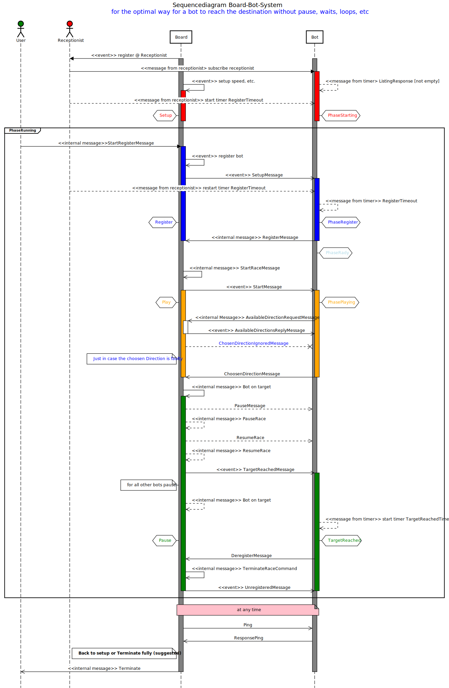
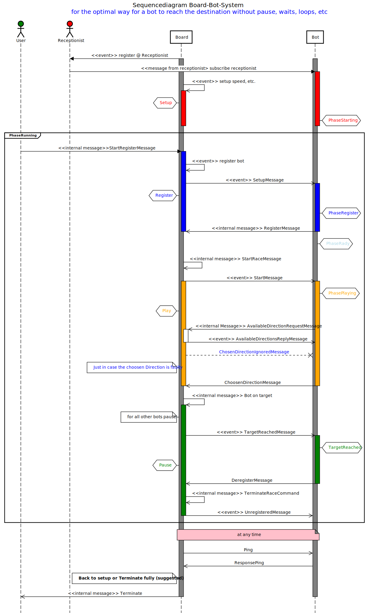

# Documentation (yet a Template)

> This is a template for the project documentation. Template comments are placed
> into Markdown notes. Replace them with your text, code fragments, and images.

> **Note:** The documentation is in progress. The notes are going to be delete when finished //Tim

## Introduction

> Give a short summary of the Bot-Race Actor system. Describe the role of the board, the bots.
> Give an example of a board layout, i.e., obstacles, starting point and target, and that bots must navigate to the
> target having
> limited information. Summarize briefly the phases of the board when playing the game.
> When referring to phases use the terms as given in the stated diagrams.

> Spend a few words on the basic principle of Akka.

The Bot-Race Actor system is a distributed system that simulates a race between bots on a board. The role of the board
is to provide the game environment, including obstacles and the target that the bots must navigate to. The bots have
limited information about the board and communicate with the board to get information about available directions and the
chosen direction.

An example of a board layout could be a rectangular grid with obstacles represented by walls or barriers. The starting
point for the bots could be at one end of the grid, and the target could be at the other end. The bots must navigate
through the grid, avoiding obstacles and reaching the target.

\
The phases of the board when playing the game are:

**Setup Phase:**\
The board is set up with the initial configuration, including the layout of obstacles and the starting
and target positions.

**Playing Phase:**\
The bots start the race, and they communicate with the board to get information about available
directions and the chosen direction. They move one step at a time, and the board updates their positions accordingly.

**Pause Phase:**\
The board can pause the race at any time, for example, if a bot reaches a specific position or if a
certain condition is met.

**Resume Phase:**\
The race can be resumed after being paused, allowing the bots to continue their movement.

**Termination Phase:** \
The race is terminated when all bots have reached the target or when a specific condition is met,
such as a certain time limit or a specific number of steps taken.

**Akka**\
The basic principle of Akka is to build distributed systems using actors, which are lightweight, isolated, and
independent units of execution. Akka provides a message-passing model where actors communicate with each other by
sending messages. Actors are resilient to failures and can be scaled horizontally by adding more actors. The Bot-Race
Actor system utilizes Akka to implement the distributed behavior of the bots and the board.

## Document the Bot / Board Interaction

> Document the interaction between a bot with the board. Use the UML sequence diagram
> you made for day 2. Discuss it (happy case). Discuss also possible error cases.

> You can reuse / include the drawings made for the first session with your coach.

> **Note:** The title of the sequence diagrams ar wrong

### Interaction between a Bot and the Board

In the happy case, the bot registers with the board, receives the setup information, and then requests available
directions to move. The board responds with the available directions, and the bot moves to a new position. This process
continues until the bot reaches the target, at which point the board sends a termination message to the bot.

#### Error Cases

**Invalid Registration:** If the bot sends an invalid registration message, the board will respond with an error
message,
and the bot will not be able to participate in the game.

**Unknown Message:** If the bot sends an unknown message to the board, the board will respond with an error message, and
the
bot will not be able to continue playing.

**Timeout:** If the bot does not respond to the board's messages within a certain time limit, the board will assume that
the
bot has timed out and will terminate the game.

### Sequencediagram without interrupts

### Sequencediagram wih interrupts

## The Design of the Board Actor System

> Document the board actor system. Use UML class diagrams and / or any other UML diagram notation
> you are familiar with. Classes in class diagrams should have minimal information such as class
> names (mandatory), major attributes, and perhaps major operations. But do not list every detail
> of classes in class diagrams; for details, the code is the documentation.

> Describe how you implemented the states (a.k.a. the phases) of the board.

> Describe the coupling of the board actor system with you UI (CLI or GUI or both). Describe
> the roles of interfaces, if any. Describe how the UI can "talk" to the actor system.
> Describe how the actor system can "talk" to the UI, and how UI-updates are performed.
> Describe, too, how and when the actor system is instantiated, and how the UI
> gets a reference to it. And also describe, how the actor system (i.e., the root actor
> of the board actor system) obtains a reference to the UI (its controller or its model).

> Describe you UI architecture. Assuming that it is architected according to the
> [MVC architectural pattern](https://en.wikipedia.org/wiki/Model%E2%80%93view%E2%80%93controller) or
> [any variant thereof](https://martinfowler.com/eaaDev/uiArchs.html),
> describe which of your classes has which role of the [MVC] pattern.

> You can reuse / include the drawings made for the second session with your coach.

### Classdiagram *(Generated by IntelliJ IDEA)*

## The Design of the Bot Actor System

> Document the bot actor system in the same spirit as the board actor system documentation, less
> the UI aspect.

> Describe how you implemented the states (a.k.a. the phases) of the board. Especially
> describe how the bot actor system terminates in the case that all its bots have
> terminated.

## The Algorithms of the Bots

> Describe the algorithm or the algorithms of your bot. Describe the reasoning of your
> design decisions. Illustrate the algorithm(s) with drawings, if suitable.

> Pseudocode of the algorithm(s)

## Administrative Issues

> For every team member: his/her experience  
> Overall experience  
> Git commit analytics

**Gil**\
BlaBla

**Martin**\
BlaBla

**Pablo**\
BlaBla

**Tim**\
Utilized Git and GitHub for version control, which was a new experience for me. I learned how to work with branches,
pull requests, and merge requests, which was a valuable skill to acquire.
Took over a part of the GUI of the project, which was a challenging but rewarding experience. We had to design and implement
the UI without a pre-defined layout, which forced us to think creatively and come up with our own solution.